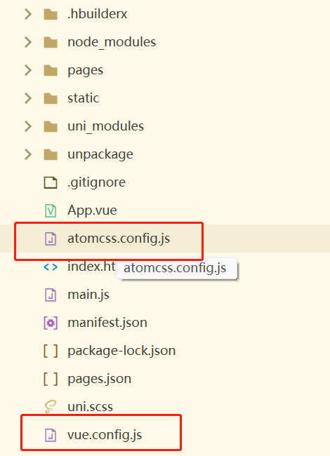

# 安装
## 第一步、安装@meizhou/atomcss
::: code-group
```bash [npm]
npm i -D @meizhou/atomcss
```

```bash [pnpm]
pnpm i -D @meizhou/atomcss
```
:::
## 第二步、修改 vue 配置文件
::: code-group
```js [vue2]
// vue.config.js
const { atomcss } = require('@meizhou/atomcss')

module.exports = {
  configureWebpack: {
    plugins: [
      atomcss()
    ]
  }
}
```

```js [vue3]
// vite.config.js
import { defineConfig } from 'vite'
import uni from '@dcloudio/vite-plugin-uni';
import { atomcss } from "@meizhou/atomcss";

export default defineConfig({
  plugins: [
    uni(),
    atomcss()
  ]
})
```
:::
## 第三步、增加 atomcss 配置文件
```js
// atomcss.config.js
import { defineConfig } from '@meizhou/atomcss'
import { preset } from "@meizhou/atomcss/preset";

export default defineConfig({
    prefix: 'a-',
    presets: [preset()], //预设
})
```

## 第四步、使用

```vue
<template>
  <view class="a-p-32 a-m-32 a-c-#2">
    <view class="a-w-100%">页面内容</view>
  </view>
</template>
```
上面的class样式将会自动被编译为：
```css
.a-p-32 { pading: 32px; }
.a-m-32 { magin: 32px; }
.a-c-_2 { color: #222222; }
.a-icon-80 { width: 80px; height: 80px;}
.a-w-100_ { width: 100%; }
```

## 项目结构示例

## 交流群
